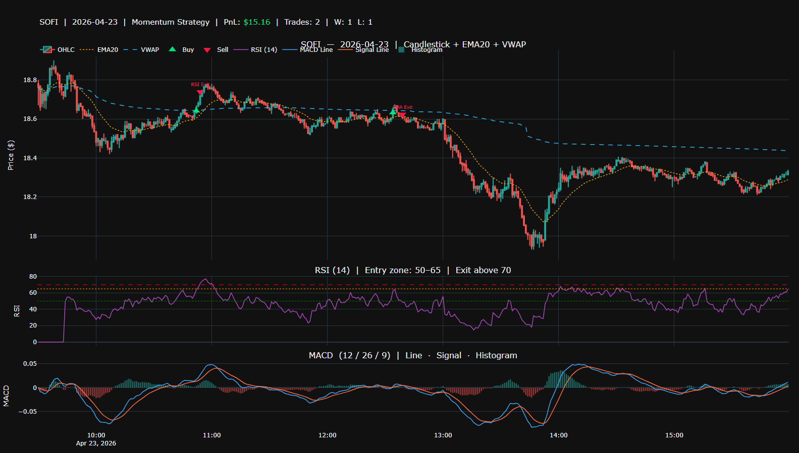

# Momentum Trade Strategy

A Python trading strategy script that downloads intraday 1-minute OHLCV data for any stock, runs a momentum-based backtest, and outputs an interactive HTML chart and a PNG image with buy/sell signals plotted directly on the candlesticks.



---

## What It Does

1. **Prompts the user** for a ticker, date, starting capital, and max trades per day
2. **Downloads 1-minute OHLCV data** from Yahoo Finance for the given stock and day
3. **Calculates indicators** — EMA20, VWAP, RSI (14), and MACD (12/26/9)
4. **Runs a momentum backtest** using a multi-condition entry signal and several exit strategies
5. **Outputs two files** — an interactive HTML chart and a static PNG — both saved to the current folder

---

## Requirements

Install all dependencies with:

```bash
pip install -r requirements.txt
```

Or run the included shell script which installs everything automatically:

```bash
./run.sh
```

### Dependencies

| Package | Purpose |
|---------|---------|
| `yfinance` | Download historical OHLCV stock data |
| `plotly` | Interactive chart rendering |
| `pandas` | Data manipulation and indicators |
| `numpy` | Numerical calculations |

---

## How to Run

```bash
python trade_strategy.py
```

You will be prompted for:

```
Enter ticker symbol (e.g. SOFI): SOFI
Enter date (YYYY-MM-DD): 2025-12-09
Enter starting capital (e.g. 10000): 10000
Enter max trades per day (press Enter for unlimited): 5
```

### Input Rules

| Field | Validation |
|-------|-----------|
| Ticker | 1–5 uppercase letters only |
| Date | YYYY-MM-DD format, no weekends, no future dates |
| Capital | Any positive number, supports `$` and `,` formatting |
| Max Trades | Positive whole number, or press Enter for unlimited |

---

## Strategy Logic

### Entry Signal

All of the following must be true to trigger a buy:

- Close price is **above the rising EMA20**
- **Volume is above** the 20-period volume moving average
- Close price is **above VWAP**
- Price moved **at least 0.1%** since the last bar
- **RSI is between 50 and 65** (momentum zone, not overbought)
- **MACD line is above the signal line** (bullish crossover active)

### Exit Conditions (checked in order)

| Exit Type | Condition |
|-----------|-----------|
| Take Profit | Price reaches +1% above entry |
| Trailing Stop | Price drops 0.5% below the highest high since entry |
| RSI Exit | RSI rises above 70 (overbought) |
| MACD Exit | MACD line crosses below signal line |
| EMA Exit | Close drops below EMA20 |
| EOD Exit | Forced flat at 3:55 PM |

### Risk Management

- **Risk-based position sizing** — risks 1% of capital per trade based on stop distance
- **Max trades per day** — user-defined cap to avoid overtrading on choppy days
- **Time filter** — skips the first 15 minutes (9:25–9:45 AM) and the last 15 minutes (after 3:45 PM)

---

## Output

After running, the script prints a trade summary:

```
Total PnL:    $142.30
Total Trades: 3
Wins:         2
Losses:       1

HTML chart saved to: /path/to/SOFI_2025-12-09.html
```

Both files are named `TICKER_DATE` and will **override any existing file** with the same name on re-run.

---

## Chart Layout

The output chart has three stacked panels sharing the same time axis:

| Panel | Contents |
|-------|---------|
| **Top (60%)** | Candlesticks, EMA20 (gold dotted), VWAP (blue dashed), buy markers (▲ green), sell markers (▼ red) with exit labels |
| **Middle (20%)** | RSI line with reference lines at 50, 65, and 70 |
| **Bottom (20%)** | MACD line, signal line, and color-coded histogram |

The chart title shows ticker, date, total PnL (green if profit, red if loss), trade count, wins, and losses.
